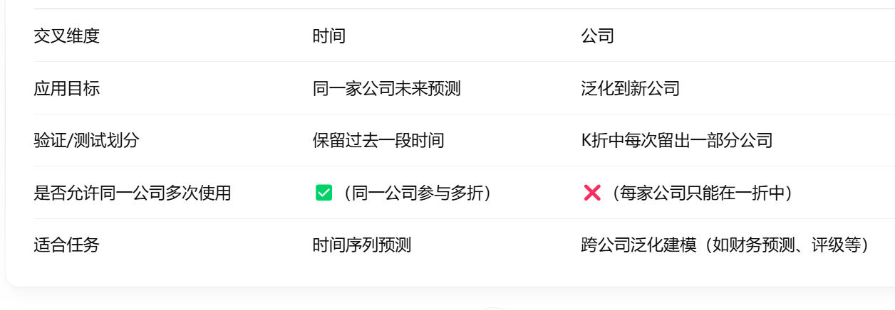

# LSTM时间序列预测模型 - 基于固定窗口滑动预测

这个项目使用LSTM神经网络对金融时间序列数据进行预测，通过固定窗口大小的滑动预测技术，使用历史连续年份数据预测未来年份的标签。

## 项目结构

- `config.py` - 配置参数，包括数据路径、特征列名、模型超参数和滑动窗口设置
- `data_loader.py` - 数据加载和预处理函数，包含时间滑动窗口生成
- `model_lstm.py` - LSTM模型定义和训练函数
- `train.py` - 主训练脚本，基于年份连续性的数据划分
- `utils.py` - 实用工具函数
- `visualize_results.py` - 结果可视化脚本，展示滑动窗口预测效果
- `data.csv` - 样本数据文件，包含公司代码、年份及多个财务指标
- `results/` - 保存训练结果、模型和可视化图表

## 时间滑动窗口预测概念

滑动窗口预测是时间序列分析中一种常用技术，特别适用于年度财务数据预测：

- **固定窗口大小**：每个样本使用固定数量(WINDOW_SIZE)的连续年份作为特征
- **目标偏移量**：预测窗口结束后TARGET_SHIFT年的标签
- **年份连续性保证**：每个窗口内的年份必须是连续的，无缺失

例如，当`WINDOW_SIZE=2, TARGET_SHIFT=1`时：
- 使用[2010, 2011]年的特征预测2012年的标签
- 使用[2011, 2012]年的特征预测2013年的标签
- 依此类推...

## 使用方法

1. 准备数据：确保数据格式与示例一致，包含公司标识、年份、特征列和标签列
2. 修改配置：根据需要在`config.py`中调整滑动窗口参数和模型设置
3. 安装依赖库：
```bash
pip install torch pandas numpy scikit-learn imbalanced-learn matplotlib seaborn
```
4. 运行训练：
```bash
python train.py
```
5. 可视化结果：
```bash
python visualize_results.py
```

## 数据格式

数据应包含以下列：
- 公司标识列 (Stckd)
- 年份列 (Accper)
- 目标预测列 (STPT)
- 特征列 (ROA, PS(TTM), ROE(C), CR, QR, WC/TA, WC/S, EBIT/TA 等)

## 基于滑动窗口的数据集划分

本项目采用基于时间序列特性的数据集划分方法：

1. **测试集**：使用最后几年的数据构建测试样本窗口
2. **验证集**：使用测试年份之前的几年数据构建验证样本窗口
3. **训练集**：使用更早的年份数据构建训练样本窗口

这种划分方法确保：
- 验证集和测试集的时间分布与实际预测场景一致
- 避免了时间上的数据泄露问题
- 符合实际应用中"用过去预测未来"的逻辑

## 处理数据不平衡

对于分类任务(如ST预测)，数据集中可能存在严重的类别不平衡问题。本项目自动应用SMOTE(Synthetic Minority Over-sampling Technique)技术来解决这一问题：

1. 自动检测标签分布情况
2. 对少数类样本进行过采样，生成合成样本
3. 平衡各类别样本数量，提高模型对少数类的识别能力

这一过程仅应用于训练集，测试集保持原始分布以反映真实场景。

## 特性

- **严格时间窗口构建**：确保每个窗口内年份连续，无缺失
- **基于时间的数据集划分**：按照滑动窗口顺序划分训练、验证和测试集
- **分类/回归自动判断**：根据标签数量自动选择任务类型
- **特征标准化**：基于训练集标准化所有特征
- **数据不平衡处理**：使用SMOTE技术平衡分类任务中的类别分布
- **详细结果可视化**：年份预测性能对比、滑动窗口可视化、混淆矩阵等
- **自动保存结果**：保存模型和测试集预测结果

## 📊 可视化结果说明

运行可视化脚本后，会在results目录下生成以下图表：

- **sliding_windows.png**: 展示滑动窗口预测的特征年份和目标年份关系
- **confusion_matrix.png**: 分类任务的混淆矩阵(如适用)
- **accuracy_by_year.png**: 分类任务中各预测年份的准确率对比(如适用)
- **true_vs_pred.png**: 回归任务的真实值vs预测值散点图(如适用)
- **rmse_by_year.png**: 回归任务中各预测年份的RMSE对比(如适用)

## 滑动窗口工作示例

假设我们有以下原始数据：

| 公司 | 年份 | 特征1 | 特征2 | 标签 |
|------|------|-------|-------|------|
| A    | 2010 | 0.5   | 1.2   | 0    |
| A    | 2011 | 0.6   | 1.3   | 0    |
| A    | 2012 | 0.7   | 1.1   | 0    |
| A    | 2013 | 0.4   | 0.9   | 1    |
| A    | 2014 | 0.3   | 0.8   | 1    |
| A    | 2015 | 0.2   | 0.7   | 0    |

当设置`WINDOW_SIZE=2, TARGET_SHIFT=1`时，会生成以下训练样本：

1. 特征窗口[2010,2011] → 预测2012年的标签(0)
2. 特征窗口[2011,2012] → 预测2013年的标签(1)
3. 特征窗口[2012,2013] → 预测2014年的标签(1)
4. 特征窗口[2013,2014] → 预测2015年的标签(0)

## 🧠 LSTM 工作机理简介

LSTM（Long Short-Term Memory）是一种专为时间序列设计的循环神经网络（RNN）架构，能够记住长期依赖信息。与传统RNN相比，它通过引入三个"门"结构解决了梯度消失问题：

- **遗忘门（Forget Gate）**：决定当前时刻应"忘记"多少旧信息；
- **输入门（Input Gate）**：决定当前输入的哪些部分需要写入记忆单元；
- **输出门（Output Gate）**：决定当前时刻输出什么内容。

LSTM非常适合固定窗口滑动预测任务，因为它可以学习窗口内年份数据之间的时序依赖关系。

两种方法：固定窗口滑动 V.S 滚动窗口，始终预测后一年的数据



